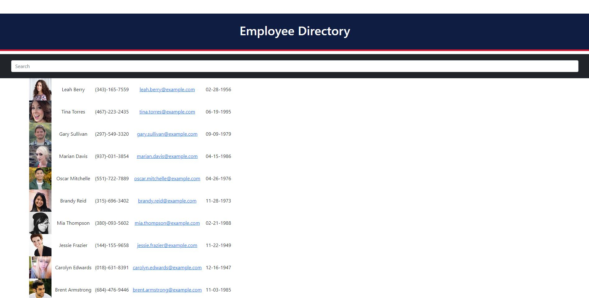

# Employee Directory
# Description
This project has a random employee generator everytime you reload the page it generates new employees.
# Deployed Application
https://tonycrosby-tech.github.io/18_employee_directory/
# Table of Contents
* [Installations](#Installations)
* [Screenshots](#Screenshots)
* [Usage](#Usage)
* [License](#License)
* [Credits](#Credits)
* [Test](#Test)
* [Contributing](#Contributing)
# Installations
> npm i
# Screenshots 

# Usage
As a user, I want to be able to view my entire employee directory at once so that I have quick access to their information.
# License
MIT
# Credits
Tony Crosby
# Test
No test command implemented but in the future there should be.
# Contributing
Commit early and often!
